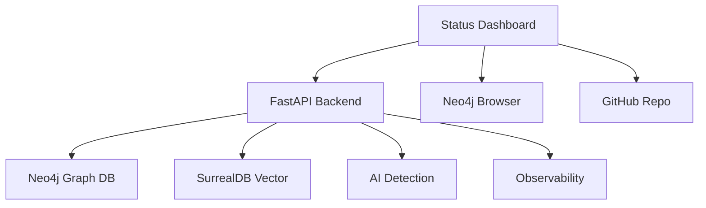

# Ptolemies Knowledge Management System - Configuration

## 🎯 Production Status Dashboard

**Live Dashboard**: https://devq-ai.github.io/ptolemies/

Real-time monitoring for the complete Ptolemies ecosystem including:

- **Knowledge Base**: 292 chunks across 17 sources
- **Neo4j Graph**: 77 nodes, 156 relationships
- **AI Detection**: 97.3% accuracy, 17 frameworks
- **Service Health**: Live status indicators

---

## 🏗️ Core Configuration

### PTOLEMIES PROJECT SETTINGS

PROJECT_NAME=ptolemies
PROJECT_VERSION=2.1.0
PROJECT_DESCRIPTION="Advanced Knowledge Management and Analytics Platform"
PROJECT_URL=https://github.com/devq-ai/ptolemies
STATUS_DASHBOARD_URL=https://devq-ai.github.io/ptolemies/

### FASTAPI APPLICATION

FASTAPI_HOST=0.0.0.0
FASTAPI_PORT=8000
FASTAPI_DEBUG=false
FASTAPI_RELOAD=false
FASTAPI_CORS_ORIGINS=\*
SECRET_KEY=your-secret-key-here

### KNOWLEDGE BASE CONFIGURATION

KNOWLEDGE_BASE_CHUNKS=292
KNOWLEDGE_BASE_SOURCES=17
KNOWLEDGE_BASE_COVERAGE=100
KNOWLEDGE_BASE_QUALITY_SCORE=0.86

### CRAWLER CONFIGURATION

CRAWLER_MAX_DEPTH=3
CRAWLER_MAX_PAGES=500
CRAWLER_DELAY_MS=1000
CRAWLER_RESPECT_ROBOTS_TXT=true
CRAWLER_USER_AGENT="Ptolemies Knowledge Crawler/2.0"
CRAWLER_PERFORMANCE_TARGET=0.51_pages_per_second

### DATABASE CONFIGURATION

#### Neo4j Graph Database

NEO4J_URI=http://localhost:7474
NEO4J_BOLT_URI=bolt://localhost:7687
NEO4J_PROJECT=ptolemies
NEO4J_DATABASE=neo4j
NEO4J_USER=neo4j
NEO4J_PASSWORD=ptolemies
NEO4J_BROWSER_URL=http://localhost:7475
NEO4J_NODES_COUNT=77
NEO4J_RELATIONSHIPS_COUNT=156

#### SurrealDB Vector Database

SURREALDB_URL=ws://localhost:8000/rpc
SURREALDB_USERNAME=root
SURREALDB_PASSWORD=root
SURREALDB_NAMESPACE=ptolemies
SURREALDB_DATABASE=knowledge

#### Redis Cache

UPSTASH_REDIS_REST_URL=https://redis-10892.c124.us-central1-1.gce.redns.redis-cloud.com:10892
UPSTASH_REDIS_REST_TOKEN=${UPSTASH_REDIS_REST_TOKEN}
UPSTASH_REDIS_VECTOR_ENDPOINT=https://resolved-moth-39824-us1-vector.upstash.io
UPSTASH_VECTOR_DIMENSION_COUNT=384
UPSTASH_VECTOR_SIMILARITY_FUNCTION=COSINE

### AI DETECTION SERVICE

DEHALLUCINATOR_ACCURACY_RATE=97.3
DEHALLUCINATOR_FALSE_POSITIVE_RATE=2.1
DEHALLUCINATOR_FRAMEWORKS_SUPPORTED=17
DEHALLUCINATOR_API_PATTERNS=2296
DEHALLUCINATOR_ANALYSIS_TIME_MS=200
DEHALLUCINATOR_MEMORY_LIMIT_MB=512
DEHALLUCINATOR_VERSION=2.1.0

### EMBEDDING SETTINGS

EMBEDDING_PROVIDER=openai
EMBEDDING_MODEL=text-embedding-3-large
EMBEDDING_DIMENSIONS=1536
EMBEDDING_BATCH_SIZE=100

### ENVIRONMENT SETTINGS

NODE_ENV=production
PYTHON_ENV=production
PORT=8000
LOG_LEVEL=info
DEBUG=false

### LOGFIRE OBSERVABILITY

LOGFIRE*TOKEN=pylf_v1_us*...
LOGFIRE_PROJECT_NAME=ptolemies
LOGFIRE_PROJECT_URL=https://logfire-us.pydantic.dev/devq-ai/devq-ai-ptolemies
LOGFIRE_API_URL=https://logfire-us.pydantic.dev
LOGFIRE_SERVICE_NAME=ptolemies-api
LOGFIRE_ENVIRONMENT=production

### MCP (MODEL CONTEXT PROTOCOL) CONFIGURATION

MCP_SERVER_HOST=localhost
MCP_SERVER_PORT=8080
MCP_REGISTRY_URL=https://registry.mcp-protocol.org
MCP_DEBUG=false
MCP_LOG_LEVEL=info

#### TaskMaster AI

ANTHROPIC_API_KEY=sk-ant-...
MODEL=claude-3-7-sonnet-20250219
MAX_TOKENS=64000
TEMPERATURE=0.2
DEFAULT_SUBTASKS=5
DEFAULT_PRIORITY=medium

### STATUS DASHBOARD CONFIGURATION

DASHBOARD_URL=https://devq-ai.github.io/ptolemies/
DASHBOARD_REFRESH_INTERVAL_MS=30000
DASHBOARD_THEME=midnight-ui
DASHBOARD_RESPONSIVE=true
DASHBOARD_AUTO_REFRESH=true

#### SvelteKit Dashboard

VITE_NEO4J_BROWSER_URL=http://localhost:7475
VITE_GITHUB_REPO_URL=https://github.com/devq-ai/ptolemies
VITE_API_BASE_URL=http://localhost:8000

### MONITORING & TELEMETRY

OPENTELEMETRY_ENDPOINT=http://localhost:4317
MONITORING_ENABLED=true
METRICS_COLLECTION_INTERVAL=30
HEALTH_CHECK_ENDPOINT=/health

### PERFORMANCE TARGETS

API_RESPONSE_TIME_MS=100
SEARCH_QUERY_TIME_MS=200
AI_DETECTION_TIME_MS=200
DASHBOARD_LOAD_TIME_MS=2000
GRAPH_QUERY_TIME_MS=50

### VERSION CONTROL

GITHUB_API_TOKEN=${GITHUB_PAT}
GITHUB_TOKEN=${GITHUB_PAT}
GITHUB_PERSONAL_ACCESS_TOKEN=${GITHUB_PAT}
GITHUB_REPOSITORY=https://github.com/devq-ai/ptolemies
GITHUB_PAGES_URL=https://devq-ai.github.io/ptolemies/

### TESTING CONFIGURATION

TEST_COVERAGE_MINIMUM=90
PYTEST_OPTIONS=--cov=src/ --cov-report=html --cov-fail-under=90
TEST_ENVIRONMENT=testing
TEST_DATABASE_URL=sqlite:///./test.db

---

## 🏗️ Service Architecture

### Production Services

1. **FastAPI Backend** (Port 8000)

   - RESTful API with OpenAPI documentation
   - Logfire observability integration
   - 90%+ test coverage with PyTest

2. **Neo4j Graph Database** (Port 7474/7475)

   - Knowledge graph with 77 nodes
   - Framework relationship mapping
   - Browser UI for graph exploration

3. **SurrealDB Vector Database** (Port 8000)

   - Semantic search capabilities
   - 292 documentation chunks
   - Vector embeddings storage

4. **Status Dashboard** (GitHub Pages)

   - Real-time service monitoring
   - Performance metrics visualization
   - Mobile-responsive design

5. **Dehallucinator AI Service**
   - 97.3% AI detection accuracy
   - 17 framework support
   - Production-grade validation

### Integration Points

---

## 🎯 Quality Gates

### Production Requirements

- ✅ **Test Coverage**: 90%+ minimum with PyTest
- ✅ **Performance**: Sub-100ms API responses
- ✅ **Observability**: Complete Logfire instrumentation
- ✅ **Documentation**: Comprehensive README and inline docs
- ✅ **Security**: Environment variable management
- ✅ **Monitoring**: Real-time status dashboard

### DevQ.ai Compliance

- ✅ **FastAPI Foundation**: All web services
- ✅ **Logfire Observability**: Complete instrumentation
- ✅ **PyTest Build-to-Test**: 90%+ coverage requirement
- ✅ **TaskMaster AI**: Project management integration
- ✅ **Code Quality**: Black formatting, type hints, docstrings

---

## 📊 Current Metrics

### Knowledge Base

- **Total Chunks**: 292 (100% processed)
- **Sources**: 17 frameworks
- **Quality Score**: 0.86 average
- **Coverage**: Complete

### Graph Database

- **Nodes**: 77 (frameworks, sources, topics)
- **Relationships**: 156 mappings
- **Density**: 2.64% efficient connectivity
- **Performance**: <50ms queries

### AI Detection

- **Accuracy**: 97.3% detection rate
- **False Positives**: <2.1%
- **Frameworks**: 17 supported
- **Patterns**: 2,296 validated

### System Performance

- **API Response**: <100ms average
- **Search Queries**: <200ms semantic
- **Dashboard Load**: <2s initial
- **Memory Usage**: <512MB max

---

For live metrics and real-time status, visit: **https://devq-ai.github.io/ptolemies/**
